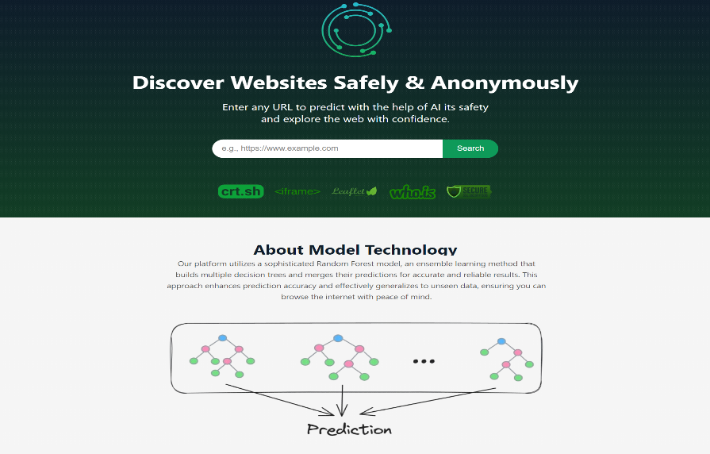
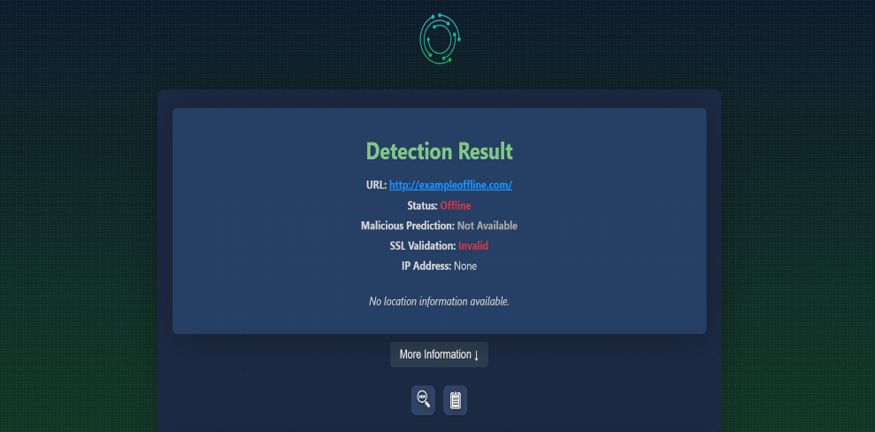
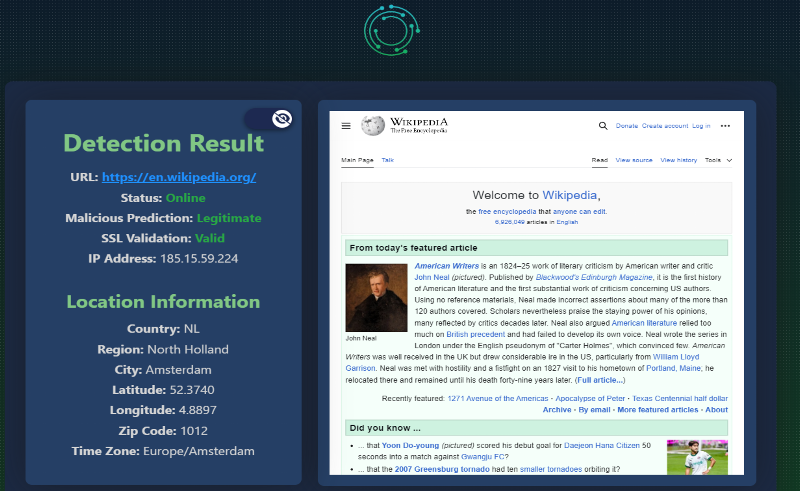
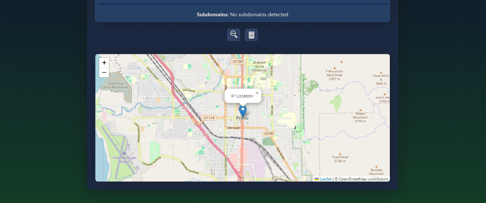
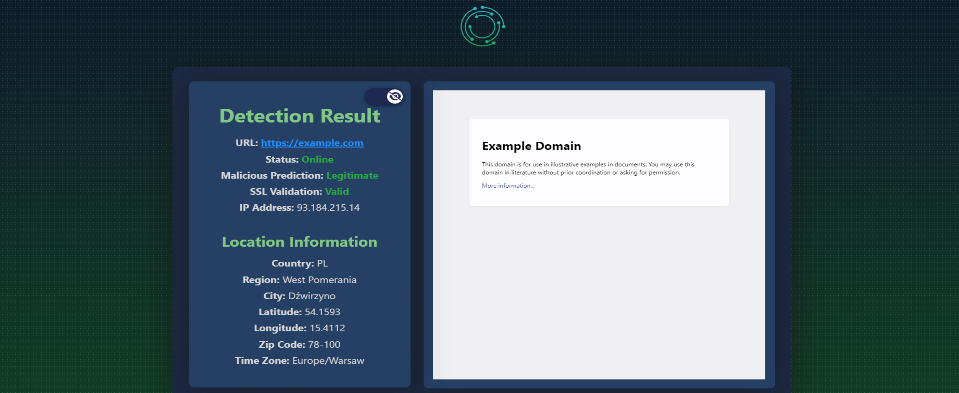

Malicious Website Scanner
=========================

AI-assisted Flask web app that predicts whether a URL is legitimate or phishing. It combines a Random Forest classifier with a curated lookup table, performs live HTTP checks, WHOIS enrichment, SSL validation, IP geolocation, and subdomain enumeration to provide an at-a-glance safety report with a visual site preview.

Screenshots Preview
-------------------
<table>
  <tr>
    <td></td>
    <td></td>
  </tr>
  <tr>
    <td></td>
    <td></td>
  </tr>
  <tr>
    <td></td>
    <td></td>
  </tr>
</table>

Overview
--------
- URL submission form with animated UI and live loading overlay.
- Prediction pipeline using a Random Forest model (`models/RandomForest.pickle`) plus a lookup table for known sites.
- WHOIS enrichment, IP resolution, geolocation (ipinfo), SSL certificate validation, and crt.sh subdomain discovery.
- Embedded site preview and status detection with graceful fallbacks for offline/unreachable URLs.
- User auth scaffold (registration/login) and SQLite-backed feedback database (Flask-Migrate).
- Request proxy configuration hooks (`proxy_config.py`) for controlled outbound traffic.

Quickstart
----------
1) Prerequisites: Python 3.12+, pip, and (optionally) Git.  
2) Clone: `git clone https://github.com/1nf1n172/malicious-website-scanner.git && cd malicious-website-scanner`  
3) Create venv: `python -m venv .venv && .\.venv\Scripts\activate` (Windows) or `source .venv/bin/activate` (macOS/Linux).  
4) Install deps: `pip install -r requirements.txt`.  
5) Initialize the app config (optional): adjust `proxy_config.py` if you need outbound proxies; set `SECRET_KEY`/database path in `app.py` if deploying.  
6) Run the server:  
   - Windows: `set FLASK_APP=app.py && flask run`  
   - macOS/Linux: `export FLASK_APP=app.py && flask run`  
7) Open `http://127.0.0.1:5000`, submit a URL, and review the detection report.

Project Structure
-----------------
- `app.py` – Flask entrypoint, routing, prediction flow, logging, SSL/IP/WHOIS/subdomain helpers.
- `features.py` / `extractor.py` – feature engineering for the ML model and WHOIS extraction.
- `models/RandomForest.pickle` / `models/lookup_table.pickle` – trained artifacts.
- `templates/` – UI pages (`index.html`, `result.html`, auth modals).
- `static/` – styles, JS, icons, and image assets.
- `migrations/` – Flask-Migrate alembic scripts for the SQLite DB (`instance/feedback.db`).
- `proxy_config.py` – outbound request configuration (swap to `requests` module wrapper).

Usage Notes
-----------
- Screenshots: place the provided PNGs into `assets/screenshots/` using the filenames from the table above so the README links render on GitHub.
- Database: SQLite file lives in `instance/feedback.db`; ensure the `instance/` directory exists (created automatically on first run).
- Logging: runtime logs go to `instance/logs.txt`.
- Rate limits: crt.sh and ipinfo have rate limits; the app includes basic retry/backoff for ipinfo calls.
- Security: replace the sample `SECRET_KEY` and consider environment variables for production deployments.

Development
-----------
- Run with reload: `flask --app app.py --debug run`
- Apply migrations (after editing models): `flask db migrate -m "msg" && flask db upgrade`

